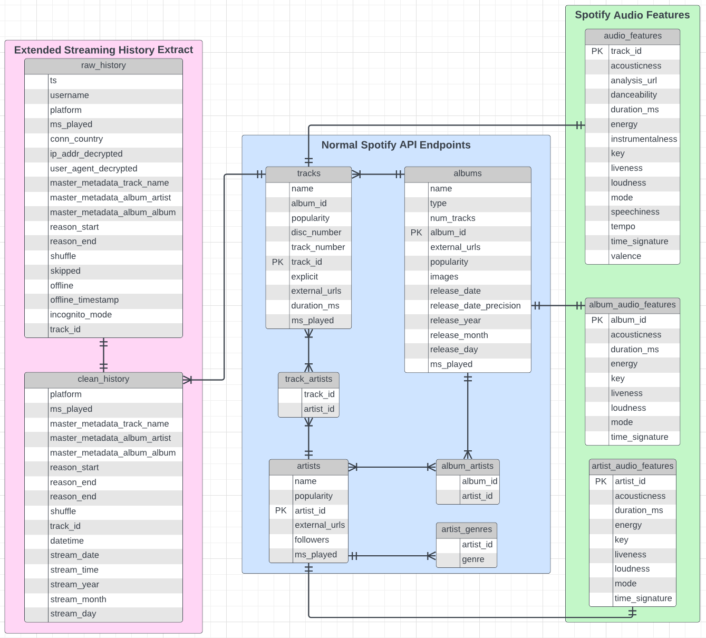

# spotify-history
## Description

This project  is a data analysis tool specifically used for looking into the Extended Streaming History (ESH) extract 
and the data associated with it in the Spotify API. Some of it is pretty jank but it works.

## Extended Streaming History
You can download this data extract from Spotify by navigating to the "Privacy" page in your account settings. Your 
ESH will take up to 30 days to download and there is a cooldown before another one can be generated once you 
download one. You can normally do it about once a month depending on how long it takes them to prepare it.

The only important piece of this extract are the files `Streaming_History_Audio_<x>.json`.

## How to run this
There are a few things you'll need to do to get this working for yourself:
1. Set up a connection with project with Spotify to grant yourself access to the API.
2. Set up a database with which to store the data.
3. Place your ESH extract in a folder and change the path in `main.py` line 21.
4. Modify the below `.env` template (see below) for use in your workspace.

### .env template
```
CLIENT_SECRET = "<your Spotify client secret>"
CLIENT_ID = "<your Spotify client id>"
DB_USER = "<your database username>"
DB_PASSWORD = "<your database password>"
DB_HOST = "<your database host>"
DB_NAME = "<your database name>"
```
## Database Model

^slightly outdated - missing discovery_date in tracks, artists, and albums

## TODO
* Clean up `charts.py` and add to repository
* Generate playlists based on audio features
* Generate monthly "Spotify Wrapped" that isn't :shit:
* Finish documenting code
* Add "album completion" detection and artificially count # of complete listens
* Add charts.py